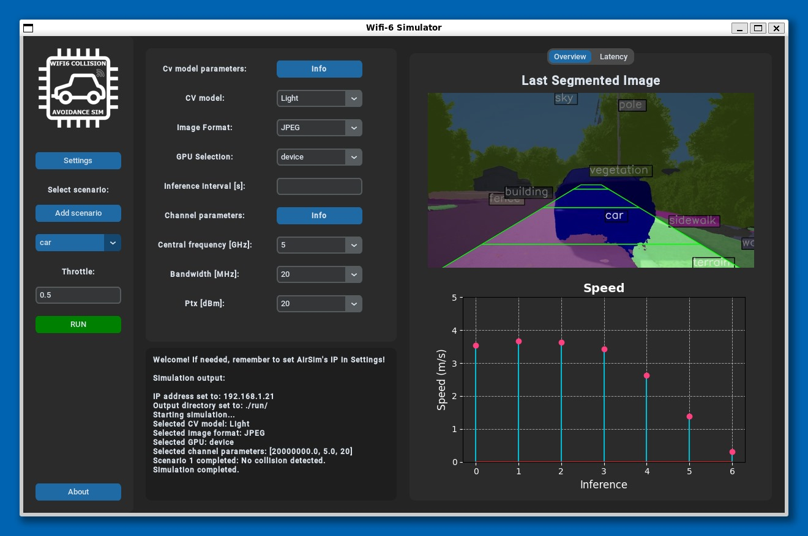

# Wi-Fi 6 Collision Avoidance Simulator

This project implements a simulation environment designed to integrate with [Microsoft AirSim](https://github.com/Microsoft/AirSim), enabling the testing of an edge service that leverages Wi-Fi 6 connectivity and computer vision for collision avoidance. The core objective is to evaluate the effectiveness of a low-latency, high-bandwidth communication service in ensuring the safety of semi-autonomous vehicles.



## Key Features

- **Wi-Fi 6 Connectivity**: Utilizes the high-speed, low-latency capabilities of Wi-Fi 6 to simulate real-time communication between the edge service and the semi-autonomous vehicle.
- **Computer Vision**: Integrates a robust computer vision system that processes real-time frames to detect obstacles, ensuring timely intervention.
- **Edge Computing**: The service runs on edge servers, minimizing latency and enabling rapid decision-making in critical scenarios.
- **Seamless Integration with AirSim**: The simulator is built on top of AirSim, allowing for realistic simulation of vehicle dynamics and environmental conditions.
- **Adaptive Control**: The vehicle's control system is designed to respond dynamically to the edge service's commands, stopping or maneuvering the vehicle when an obstacle is detected.

## Use Cases

- **Safety Testing**: Evaluate the system’s effectiveness in various collision scenarios, including pedestrians, vehicles, and static obstacles.
- **Performance Benchmarking**: Measure the impact of Wi-Fi 6 on communication latency and the overall responsiveness of the collision avoidance system.
- **Scenario Simulation**: Test in a variety of environments and under different conditions to ensure robustness and reliability.

## Instructions

1. Download and unzip the [AirSimNH](https://github.com/microsoft/AirSim/releases) scenario
2. Clone this repository
3. Create a VENV environment (Conda is not suggested and could cause bugs in the GUI) and activate it
4. Install the needed dependencies with pip
```
customtkinter==5.2.2
ftfy==6.2.0
numpy==2.0.0
pillow==10.3.0
regex==2024.5.15
requests==2.32.3
scipy==1.13.1
matplotlib==3.9.0
msgpack−rpc−python
airsim
```
5. Install Pytorch following the [official guide](https://pytorch.org/get-started/locally/)
6. Install MMCV and MMSegmentation following the [official guide](https://mmsegmentation.readthedocs.io/en/latest/get_started.html#installation)

At this point everything should be ready.\
To run the simulator, first start AirSim. Next, ensure that your VENV environment is active, and then execute the following command:
```
python ./app/GuiApp.py
```
Once started, if needed, go into settings and insert the ip address of the machine on which AirSim is running.

## Docker

An image is also available on [Dockerhub](https://hub.docker.com/r/bert99/collision_sim) to easily run the project skipping the installation part.

You need an X server installed on the host machine. If you are on Windows you can use WSL2 as a workaround.
